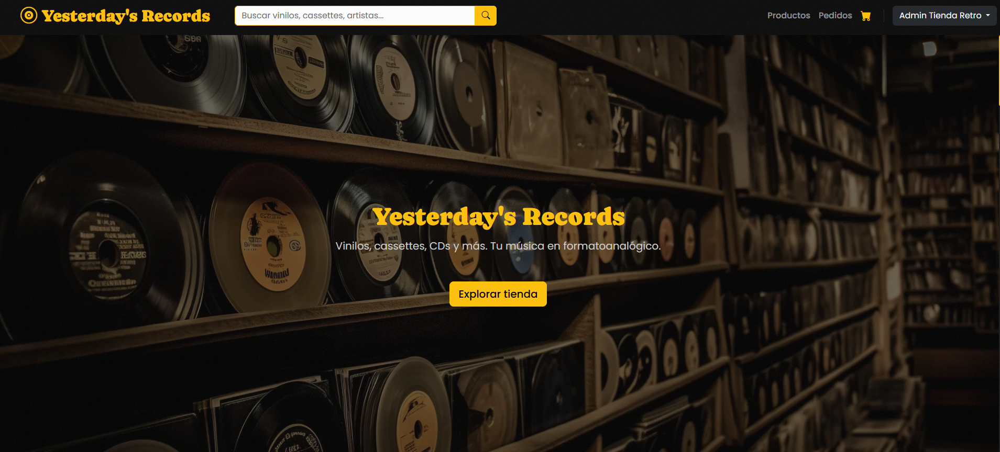

# Yesterday's Records

Tienda de discos de vinilo, cassettes, CDs y merchandising retro con temática de los años 70-90.

## Screenshot



## Funcionalidades

### Clientes
- Explorar catálogo de productos con filtros por categoría, género y búsqueda
- Ver detalle de cada producto con selector de cantidad
- Carrito de compras con persistencia
- Checkout con integración Stripe (modo test)
- Registro y login con verificación por email
- Perfil de usuario con edición de datos y gestión de direcciones
- Historial de pedidos

### Administrador
- Panel de administración con productos y pedidos
- CRUD completo de productos (crear, editar, eliminar)
- Subida de imágenes para productos
- Gestión de pedidos: cambiar estado (pendiente/pagado/enviado)
- Eliminar pedidos con restauración automática de stock
- Cancelación masiva de pedidos pendientes mayores a 24hs
- Filtros y búsqueda en productos y pedidos
- Paginación en todas las listas

## Stack Tecnológico

| Capa | Tecnología |
|------|-----------|
| Frontend | HTML5, CSS3, JavaScript vanilla, jQuery, Bootstrap 5.3 |
| Backend | PHP 8.2 (sin framework) |
| Base de datos | MySQL 8+ / MariaDB 10.4+ |
| Pagos | Stripe (modo test) |

## Requisitos previos

Necesitas tener instalado en tu computadora:

1. **XAMPP** — Esto instala Apache (servidor web), MySQL (base de datos) y PHP de una vez.
2. **Un navegador web** — Chrome, Firefox, Edge, etc.

> Si nunca has instalado XAMPP, busca en YouTube "instalar XAMPP Windows" y sigue un tutorial.

## Instalación paso a paso

### 1. Clonar o descargar el proyecto

```bash
git clone https://github.com/smmu94/yesterdays_records.git
```

O descarga el ZIP desde GitHub y descomprímelo.

### 2. Mover la carpeta al servidor

Copia la carpeta del proyecto dentro de la carpeta `htdocs` de XAMPP:

```
C:\xampp\htdocs\yesterday-records\
```

### 3. Crear la base de datos

1. Abre **phpMyAdmin** — ve a `http://localhost/phpmyadmin` en tu navegador
2. Haz clic en la pestaña **Importar** (arriba)
3. Haz clic en **Seleccionar archivo** y busca el archivo:
   ```
   sql/yesterdays_records.sql
   ```
4. Haz clic en **Continuar** o **Ir** al fondo de la página
5. Espera a que termine. Verás un mensaje de éxito y la base de datos `yesterdays_records` aparecerá en el panel izquierdo

### 4. Configurar variables de entorno

Copia el archivo `.env.example` como `.env`:

```bash
cp .env.example .env
```

Edita `.env` con tus datos:

```env
DB_HOST=localhost
DB_USER=root
DB_PASS=
DB_NAME=yesterdays_records
APP_URL=http://localhost/yesterday-records
STRIPE_SECRET=sk_test_TU_CLAVE_AQUI
```

- `APP_URL` — La dirección donde corre tu proyecto
- `STRIPE_SECRET` — Tu clave secreta de Stripe (modo test). Si no tienes cuenta en Stripe, créala gratis en [stripe.com](https://stripe.com) y busca la clave en el dashboard

### 5. Iniciar el servidor

1. Abre el panel de control de XAMPP
2. Inicia **Apache** y **MySQL** (haz clic en "Start" al lado de cada uno)
3. Accede a `http://localhost/yesterday-records`

## Usuarios de prueba

| Usuario | Email | Contraseña | Rol |
|---------|-------|------------|-----|
| Admin | admin@tiendaretro.com | Admin123! | admin |
| Marta | marta.fernandez@example.com | Cliente123! | client |

## Estructura del proyecto

```
yesterday-records/
├── index.html                 # Punto de entrada SPA (único archivo HTML)
├── .env.example               # Plantilla de variables de entorno
├── .env                       # Variables de entorno (NO subir a git)
├── api/                       # Endpoints PHP (backend)
│   ├── auth.php               # Login, registro, verificación
│   ├── products.php           # Catálogo de productos
│   ├── product.php            # Producto individual
│   ├── cart.php               # Carrito de compras
│   ├── checkout.php           # Pago con Stripe
│   ├── profile.php            # Perfil del usuario
│   ├── addresses.php          # Direcciones del usuario
│   ├── admin.php              # CRUD admin + gestión de pedidos
│   ├── categories.php         # Categorías
│   ├── genres.php             # Géneros musicales
│   └── cities.php             # Ciudades
├── config/                    # Configuración
│   ├── database.php           # Conexión a MySQL (lee de .env)
│   ├── keys.php               # Claves secretas (NO subir a git)
│   ├── helpers.php            # Funciones auxiliares (respond, success, error)
│   └── views.php              # Vistas MySQL del catálogo
├── views/                     # Plantillas HTML (se cargan dinámicamente)
│   ├── home.html              # Página principal
│   ├── cart.html              # Carrito
│   ├── checkout.html          # Pago
│   ├── login.html             # Inicio de sesión
│   ├── register.html          # Registro
│   ├── verify.html            # Verificación de email
│   ├── profile.html           # Perfil de usuario
│   ├── product.html           # Detalle de producto
│   ├── 404.html               # Página no encontrada
│   ├── navbar.html            # Barra de navegación
│   └── admin/                 # Vistas de administrador
│       ├── products.html      # Lista de productos
│       ├── orders.html        # Lista de pedidos
│       └── product-form.html  # Formulario de producto
├── js/                        # JavaScript
│   ├── app.js                 # Router SPA, navbar, sesión
│   ├── catalog.js             # Catálogo con paginación
│   ├── cart.js                # Lógica del carrito
│   ├── checkout.js            # Lógica de pago
│   ├── auth.js                # Login y registro
│   ├── profile.js             # Perfil y direcciones
│   ├── admin-products.js      # CRUD productos (admin)
│   ├── admin-orders.js        # Gestión pedidos (admin)
│   ├── utils.js               # Funciones utilitarias
│   └── effects.js             # Efectos visuales (scroll reveal, partículas)
├── styles/
│   ├── style.css              # Estilos globales
│   └── effects.css            # Estilos de micro-interacciones
├── assets/                    # Imágenes y recursos estáticos
│   ├── favicon.ico            # Icono de pestaña (YR)
│   ├── favicon.png            # Icono de pestaña (PNG)
│   ├── default.webp           # Imagen por defecto de productos
│   ├── vinilos.webp           # Imagen de fondo del hero
│   └── home.png               # Screenshot del sitio
├── sql/
│   └── yesterdays_records.sql # Script de base de datos + datos de prueba
└── .gitignore                 # Archivos ignorados por git
```

## Cómo funciona

### SPA (Single Page Application)

El proyecto usa hash routing (`#/home`, `#/cart`, etc.). Todo se carga en una sola página `index.html` y el contenido se intercambia dinámicamente con JavaScript. No hay recarga de página.

### Backend PHP

Cada archivo en `api/` es un endpoint independiente. No hay framework, solo PHP puro con MySQLi. Las respuestas son JSON.

### Base de datos

El script SQL crea automáticamente vistas MySQL (`v_products`, `v_order_detail`) que facilitan las consultas del catálogo. Estas vistas se recrean en cada petición desde `config/database.php`.

### Variables de entorno

El proyecto detecta automáticamente si está en desarrollo (localhost) o producción, y carga las credenciales de base de datos desde el archivo `.env`. Nunca subas `.env` a git.

## Cuentas de Stripe (modo test)

Para probar el pago, usa las tarjetas de prueba de Stripe:

| Tarjeta | Resultado |
|---------|-----------|
| `4242 4242 4242 4242` | Pago exitoso |
| `4000 0000 0000 0002` | Pago rechazado |

Usa cualquier fecha de expiración futura y cualquier CVC de 3 dígitos.
